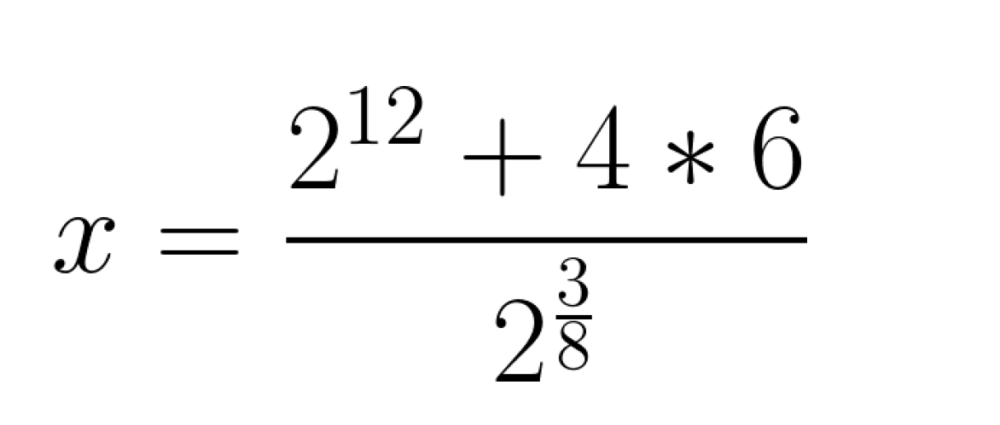

# Задание 1.1 - Математическое выражение
Вам необходимо написать программу на языке Python, которая вычисляет значение выражения: 

## Дополнительно
1. Программа должна быть представлена в виде одного файла с именем task_01_01.py

